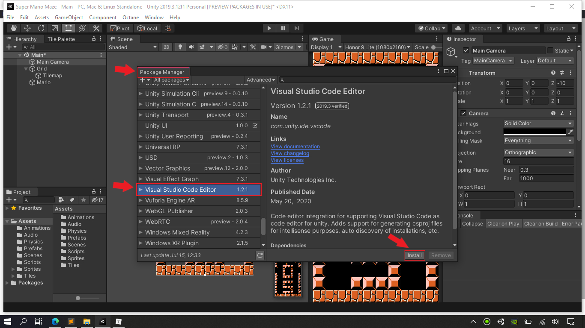
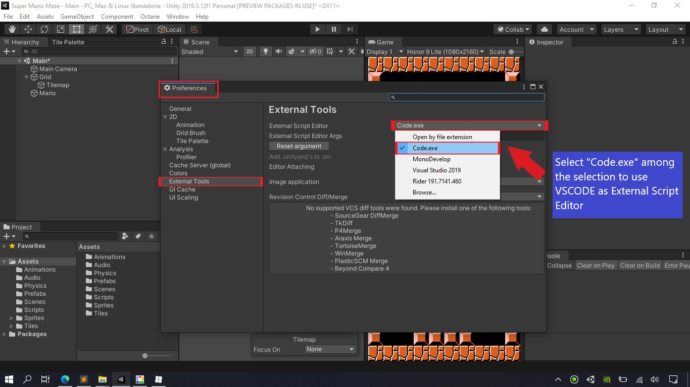
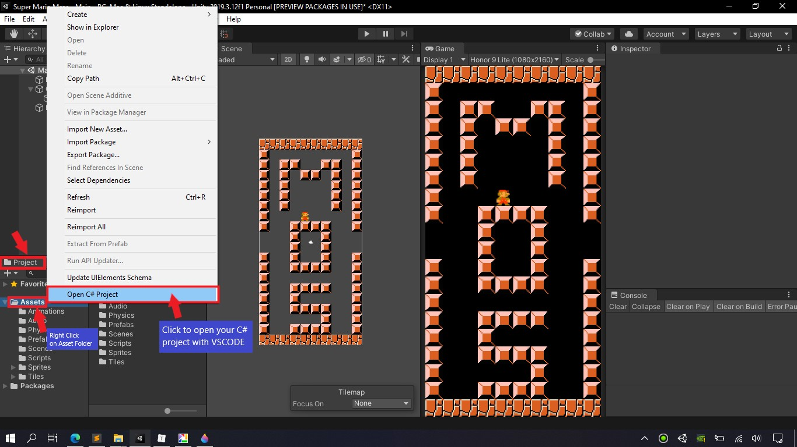

## 											VSCODE AND UNITY SETUP

> Step-1: Download and install both **.NET 4.7.1 developer pack** and **VSCODE** from their official sites.
>
> ​		**-**  **.NET 4.7.1 Developer Pack** ------ https://www.microsoft.com/en-us/download/details.aspx?id=56119
>
> ​		**-**  **VSCODE Insider Edition 2020** ------ https://code.visualstudio.com/insiders/

> Step-2: Download and install Extensions from **VSCODE Market Place**.
>
> 		1. Debugger and Compiler Extentions
> 			* C# (Ominisharp) -------------------------- By Microsoft
> 			* Debugger for Unity ----------------------- By Unity Technologies 
> 		
> 		2. Unity Code snippets and Keymap Extentions
> 			* Unity Code Snippets ---------------------- By Kleber Silva
> 			* Visual Studio Keymap --------------------- By Microsoft
> 	
> 		3. Code themes and Icon packs  [OPTIONAL]
> 			* Monkai Pro ------------------------------- By Monkai
> 			* Material Theme Icons --------------------- By Mattia Astorino
> 			* Moxer Theme and Icons--------------------- By Mattia Astorino

> Step-3: Download and Import "**Visual Studio Code Editor**" package inside **Unity's Package Manager**.
>
> ​																				**Window** > Package Manager 	

> Step-4: Change the External Script Editor software to **VSCODE** 
>
> ​								**Edit** > **Preferences** > **External Tools** > External Script Editor [**SELECT code.exe**]
>
> 

 

> Step-5: Right Click on your **Asset Project** and Click **Open C# Project**
>
> 

// THANKS FOR WATCHING MY VIDEO, PLEASE MAKE SURE TO LEAVE LIKE AND COMMENT IF YOU LIKED IT!
